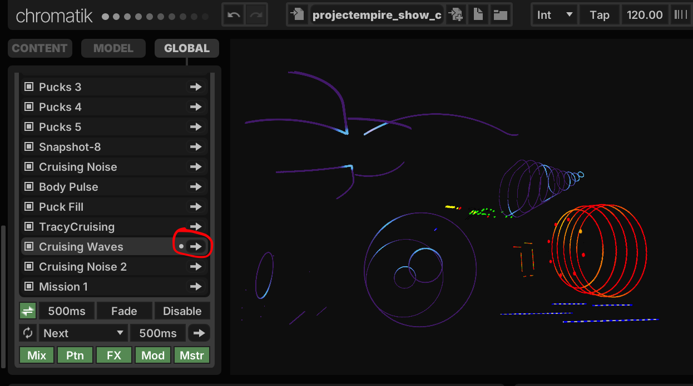
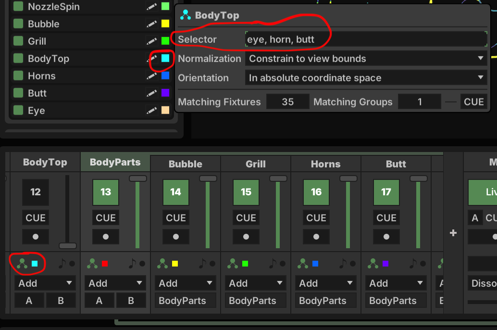
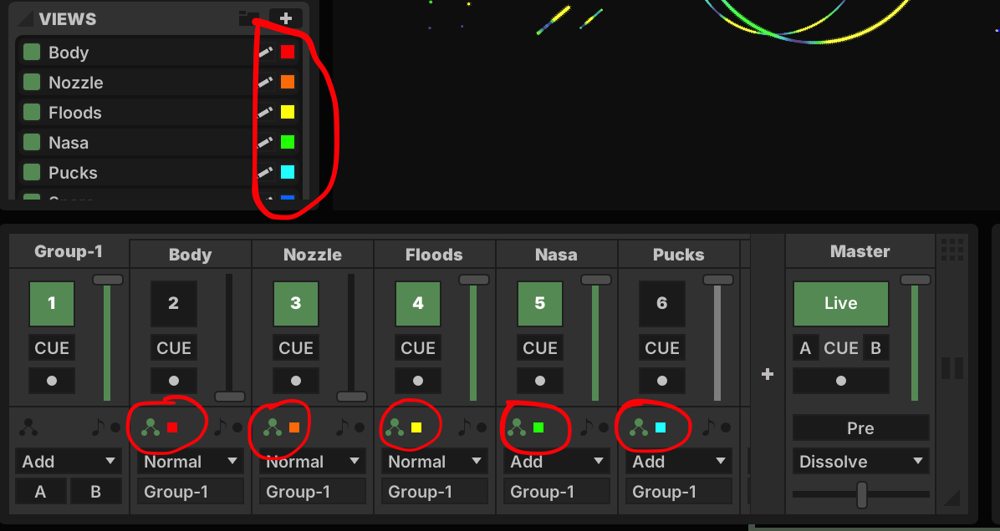
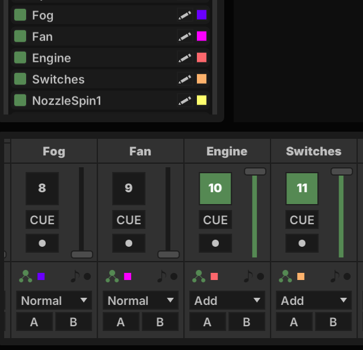
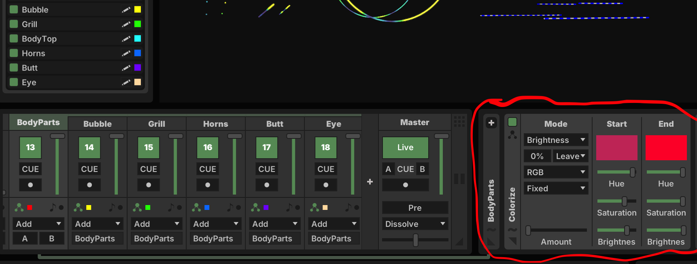
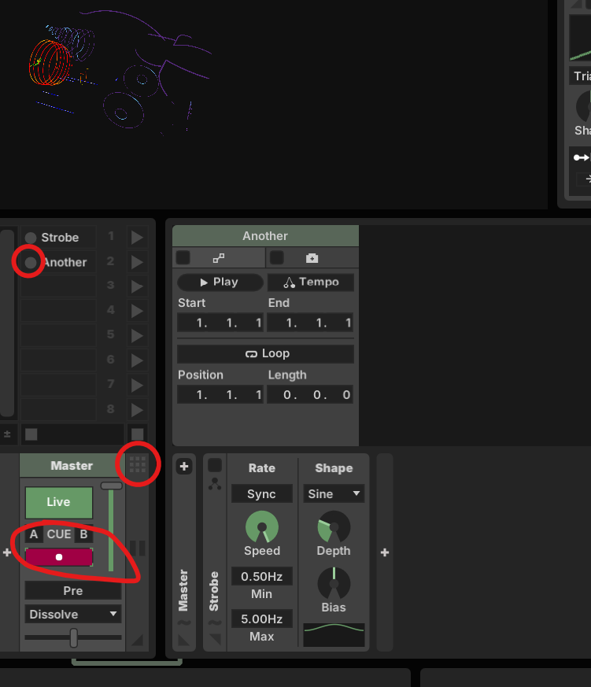
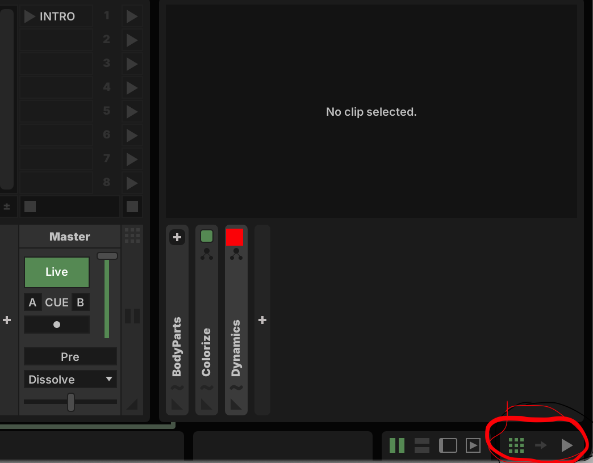
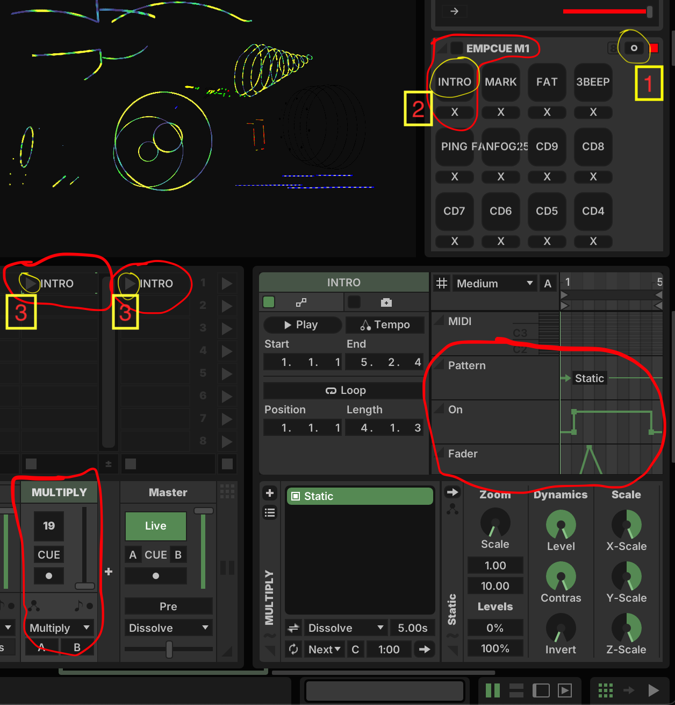

# Empire Show Guide

## Overview

The overall file organization relies on Snapshots to switch the car to specific looks.  When selecting a snapshot, certain channels and patterns will become active while other channels and patterns will become inactive.

## Views

The components of the model are grouped into Views.  Each view contains a reference to a list of fixture tags specifying which fixtures should be included in that view.

## Channels

There are currently quite a few channels because there are many components to the model.  I didn't want to break any backwards compatibility so I preserved the existing channels.  The existing layout was a group, called Group-1, consisting of Body, Nozzle, Floods, Nasa, and Pucks.  Also highlighted in this image is the mapping of specific channels to specific model views.  Because these channels are in a single group, the fader on the Group-1 channel can be used to bring up or down the levels of all the channels in the group.  It also allows for channel effects to be applied to all channels in the group.

The Fog, Fan, Engine, and Switches are not in any group.  The Fog and Fan have simple solid white patterns and the fader level controls the value of the control signal that drives their operation.

In order to allow for more fine-grained visuals for different body parts I added some additional views and additional channels to target those views.  Above is an example of a red colorize applied to the BodyParts group.  This is enabled during a clip that runs as part of the Mission 1 soundtrack when we want the body to turn red.

## Clips

Clips allow for short segments of automation to be run when triggering the clip.  To open the clips panel, click on the grid of squares to the top right of 'Master' channel.

You can record the actions to run in a clip by arming the record button on a channel and then clicking on the record button next to the clip name.

Make sure that you are in Clip mode and not pattern grid mode.  It is selectable in the bottom right of your screen.

Official Guide to Clips
https://chromatik.co/guide/grid/

## Cues

The QLab cues for the Mission 1 soundtrack come into Chromatik as OSC messages of the form /empire/cue *cuename* For the latest iteration, I implemented everything as simple cues that trigger clips.  The previous cues could send parameterized OSC messages and would remap the cue OSC message using the cues.lxp file.  That mechanism should still be working if you want more control.  It is more powerful, but also requires restarting Chromatik and the iteration cycle for fine tuning is longer.  If the *cuename* is not found in cues.lxp, the code will search for triggers contained in a Modulator where the prefix of the name is EMPCUE.  If it finds a matching trigger name, it will fire that trigger.  I implemented a custom modulator that allows for dynamically adding a list of named TriggerParameters so it is easy to handle new cues without restarting Chromatik.

Above is an example of the INTRO cue.  It will trigger clips on the MULTIPLY channel and the Master channel.  Shown above is the clip for the MULTIPLY channel.  It enables the channel and brings up the fader and then brings down the fader and then disables the channel.  When triggering clips you typically will want to return some previous state.  For this example, the multipy is faded down and then the channel is disabled.

In order to map the trigger so that it will trigger clips, click on the trigger modulation mapping icon (1), then click on the trigger you want to map (2), and finally click on destination (3).  To map a trigger to multiple destinations, repeat steps (1) and (2) and then choose another target (3).